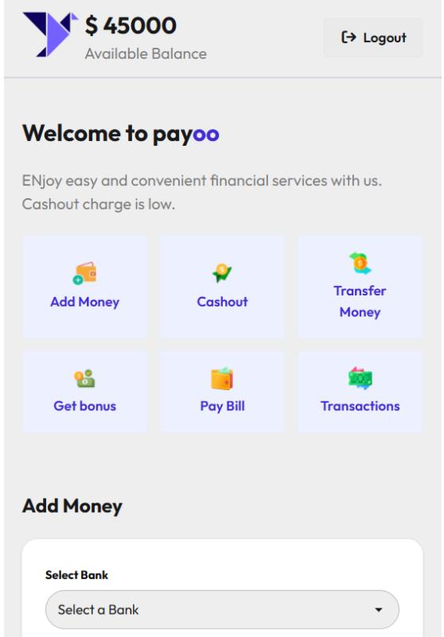

# 💳 PAYOO  
### *Smart Mobile Financial Services (MFS) Web Application*

---

<p align="center">
  <b>Secure • Simple • Fast Digital Banking Experience 🚀</b>
</p>

---

## 📖 Overview

**PAYOO** is a modern Mobile Financial Services (MFS) web application designed to provide a smooth and secure digital banking experience.

It allows users to perform essential financial operations such as adding money, cashing out, transferring funds, and viewing transaction history in one place. Every transaction is protected with PIN verification to ensure security and trust.

Built with a focus on simplicity, responsiveness, and usability, PAYOO delivers a clean and efficient interface for everyday financial management.

---

## 🌐 Live Demo

🔗 **Live Website:**  
👉 https://mishu78.github.io/payoo-project/

---

## 🖼️ Screenshots

<p align="center">

  <strong>🏠 Homepage</strong><br/>
  
  <br/><br/>

  <strong>💰 Add Money</strong><br/>
  
  <br/><br/>

</p>

---

## 🛠️ Technology Stack

- 💻 **Frontend:** HTML5, CSS3, JavaScript (ES6+)  
- 🎨 **UI Framework:** DaisyUI, Tailwind CSS  
- ⚙️ **Logic:** Vanilla JavaScript (DOM Manipulation)  
- 🔧 **Tools:** Git, GitHub, VS Code  

---

## ✨ Key Features

- 🔐 Secure Login System  
- 💰 Add Money to Wallet  
- 💸 Cash-Out (Withdraw System)  
- 🔁 Money Transfer Feature  
- 📊 Transaction History Tracking  
- 🔑 PIN Verification for Every Transaction  
- 📱 Fully Responsive Design  
- 🎨 Clean & Modern UI  

---

## 📦 Dependencies

This project is built using only frontend technologies.

### Requirements:
- A modern web browser (Chrome, Firefox, Edge)

No installation of frameworks or backend required.

---

## 🚀 Run Locally

Follow these steps to run the project on your local machine:

### 1️⃣ Clone the Repository

```bash
git clone https://github.com/Mishu78/payoo-project.git
```

---

### 2️⃣ Navigate to Project Folder

```bash
cd payoo-project
```

---

### 3️⃣ Open the Project

Simply open the `index.html` file in your browser:

```bash
start index.html
```

Or just double-click the file.

---

## 📁 Project Structure

```
payoo-project/
│── index.html
│── style.css
│── script.js
│── assets/
│     ├── 1.jpg
│     ├── 2.jpg
│     ├── 3.jpg
│── README.md
```

---

## 🔗 Relevant Links

- 📂 **GitHub Repository:**  
  https://github.com/Mishu78/payoo-project  

- 🌍 **Live Project:**  
  https://mishu78.github.io/payoo-project/  

---

## 🎯 Future Improvements

- 📲 Mobile App Version  
- 🌙 Dark Mode Support  
- 🔔 Notification System  
- 🔐 Enhanced Authentication System  
- 📈 Analytics Dashboard  

---

## 👩‍💻 Author

**Meherun Nesa Mishu**  
Passionate Web Developer focused on building clean and user-friendly applications.

---

<p align="center">
  ⭐ If you like this project, don’t forget to star the repository!
</p>
